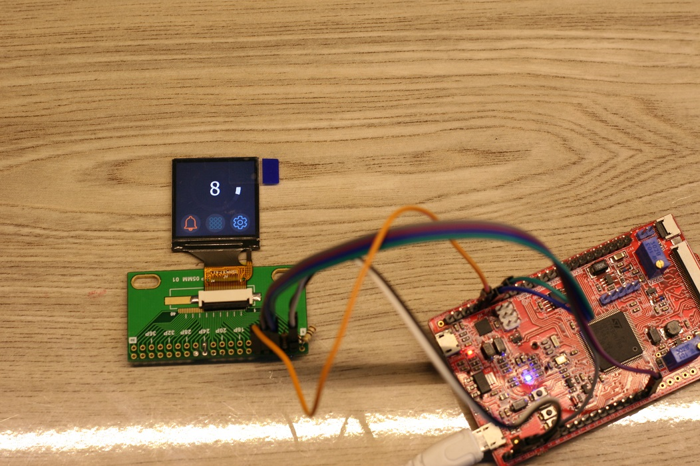
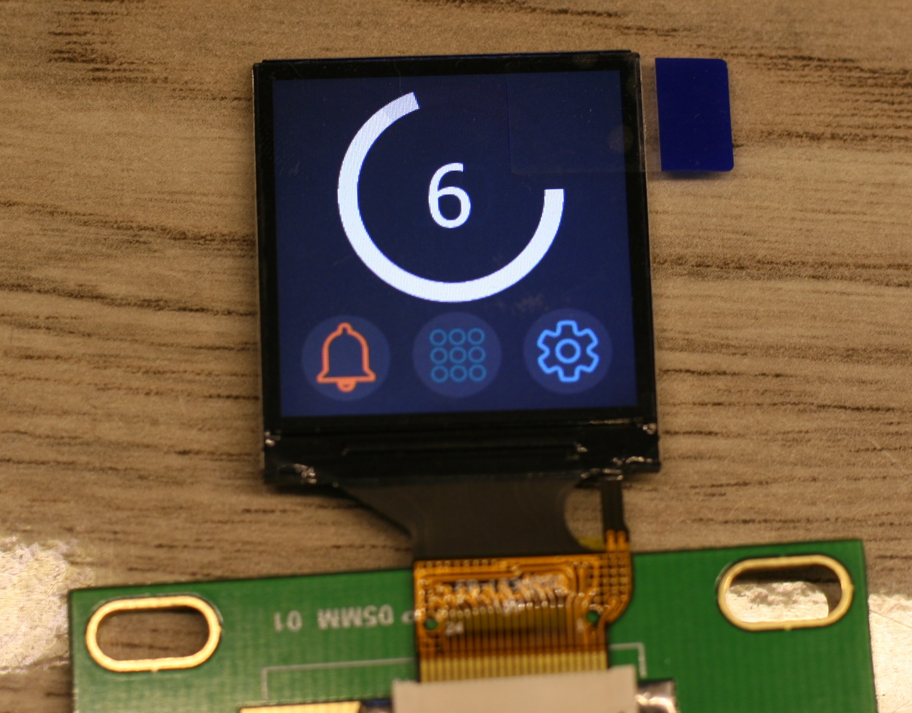
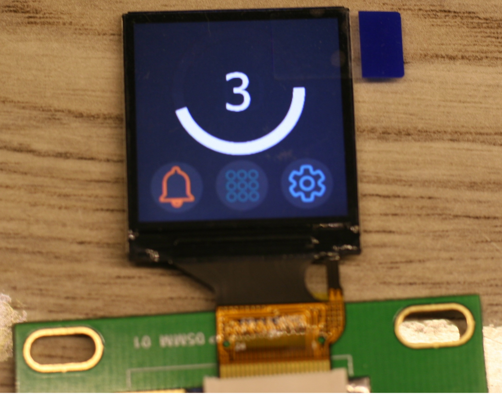

# STM32 EmWin GUI Library driving 1.3" TFT
When searching for a proper LCD regarding another project, I encountered this [tiny 1.3-inch LCD](https://kavirelectronic.ir/eshop/tft-lcd-13-inch/1201021-tft-lcd-13inch-ips-screen-240x240-spi-st7789.html). This LCD has a resolution of 240 by 240 pixels and because of the small size of it, this TFt offers a high pixel density that is hard to find in other displays used in embedded projects. So I bought one for myself.
## Hardware description
The driver of this is called ST7789 and it can communicate over SPI or parallel data transfer. I also bought the [development board](https://kavirelectronic.ir/eshop/my-productions/1201808-ewb-stm32h7b0.html) from the same online store. The board consists of an STM32H7B0 microcontroller and two W25Q64 chips for external flash usage. I wrote the code SPI communication on this development board and the chip is OK to work.
I Configure the project using STM32CubeMX and utilized SPI2 for communication. The SPI speed is tested at 30MHz and the DMA transfer is configured to minimize the latency and increase frame rate. Because the STM32H7B0 chip has only 128kBytes of internal flash, a bootloader is flashed on the chip, and the main code is uploaded on the W25Q64 external chip using the provided STLDR file.
## Graphic library
The communication library is written and can be found in the `st7789` folder in the repository. With this library, you can initialize the LCD chip and do some basic graphic stuff.
For more complex graphics, I ported the EmWin library to work with my setup. The important configuration files are placed in the `STemWin/Config` folder. By using this configuration file, you can use the EmWin graphic library at its full potential.
Finally to test the library I designed a demo graphic page using `Segger` [Appwizard](https://www.segger.com/products/user-interface/emwin/tools/appwizard/) tool. This tool makes GUI design a lot easier and the progress of development faster.
In the pictures below you can see some photos of the working setup.

